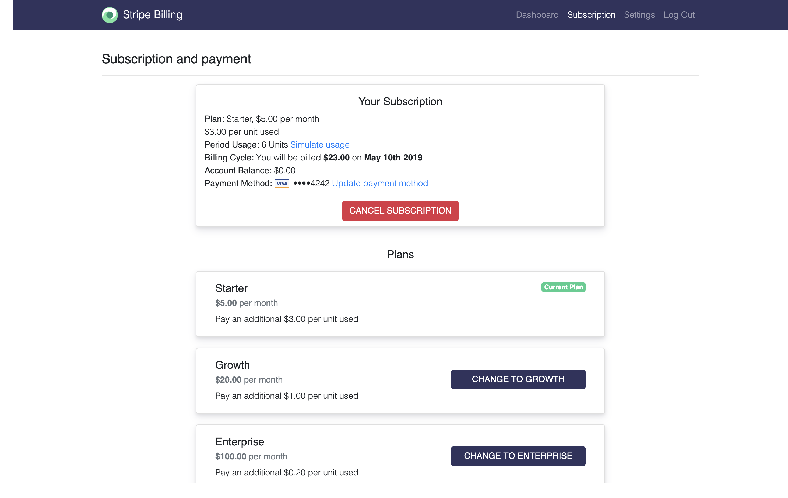

## Description

A sample Stripe Billing demo



## Prerequisites
[Mongodb](https://treehouse.github.io/installation-guides/mac/mongo-mac.html)

[Node.js (v9)](https://nodejs.org/en/)

## Instructions

Follow the steps below to get the app running on your local machine.

First, clone the repository and install dependencies.
```bash
$ git clone git@git.corp.stripe.com:mattmitchell/sales-billing-demo.git
$ cd sales-billing-demo
$ npm install
```

Create a new Stripe application and add both the secret / publishable keys to the .env file (rename sample.env to .env).

Make sure mongoDB is running in a separate terminal tab. This local database is used to store the user and item objects.

```bash
$ mongod
```

Start the server.

```bash
$ npm start
```

Open a web browser and navigate to [http://localhost:3000/](http://127.0.0.1:3000/)
to see the example in action.
